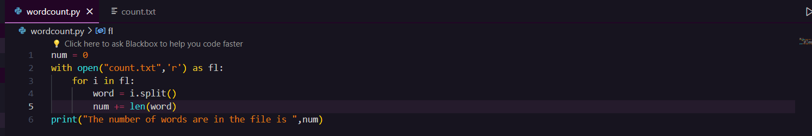

# Word-Count
## AIM:
To write a python program for getting the word count from a text.
## EQUIPEMENT'S REQUIRED: 
PC
Anaconda - Python 3.7
## ALGORITHM: 
### Step 1:
Create a file with .txt file extension
### Step 2: 
Add some text in that file
### Step 3: 
Create a python file
### Step 4:  
Write the code to count the number of words in that file
### Step 5: 
Run the program
### Step 6: 
Display the output
## PROGRAM:
```
#program to find the number of words in a text file
#Developed by : VINISHRAJ R
#Register number : 212223230243

num = 0
with open("count.txt",'r') as fl:
    for i in fl:
        word = i.split()
        num += len(word)
print("The number of words are in the file is ",num)
```
### OUTPUT:


## RESULT:
Thus the program is written to find the word count from a text.
